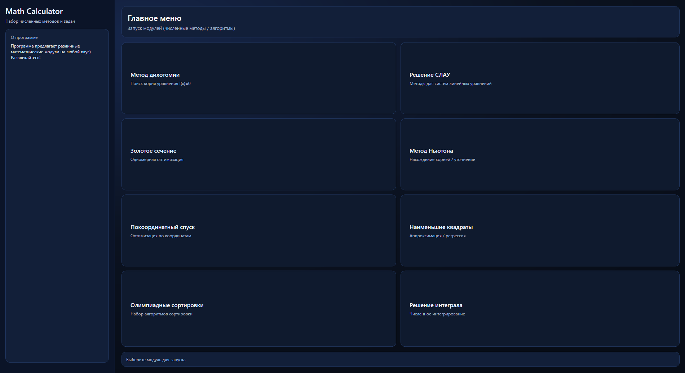
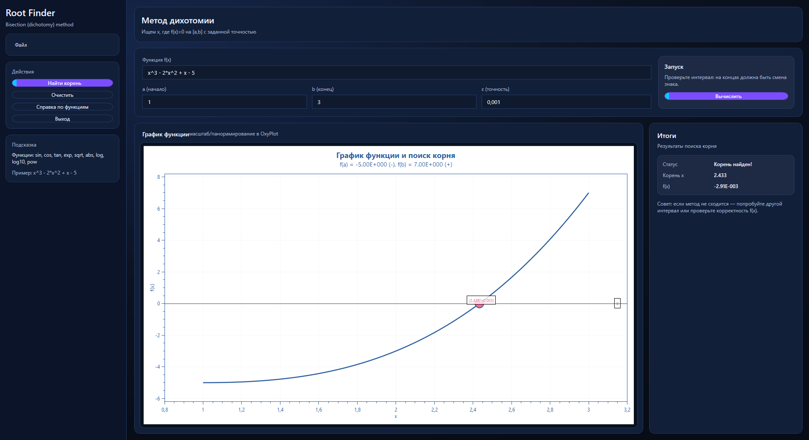
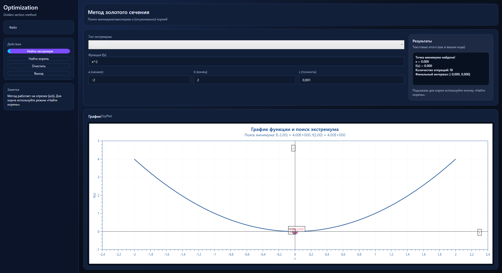
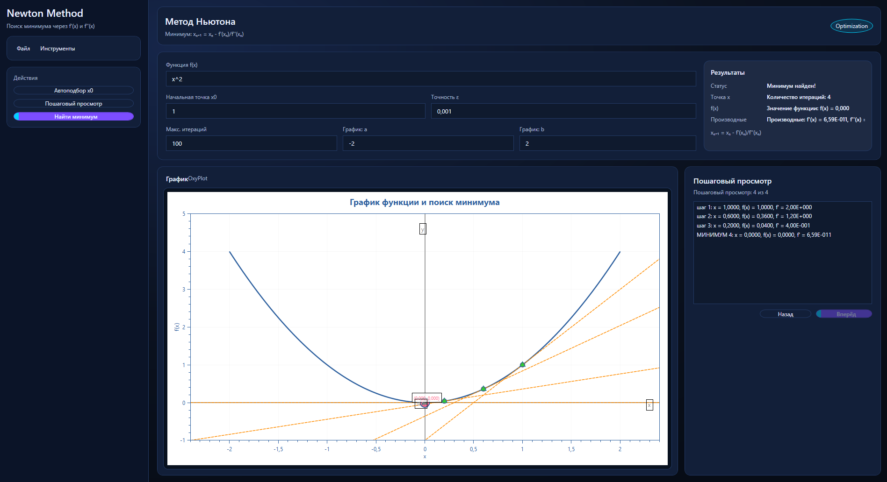
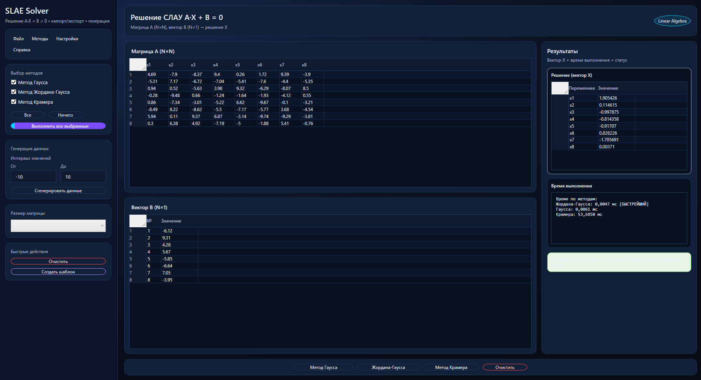
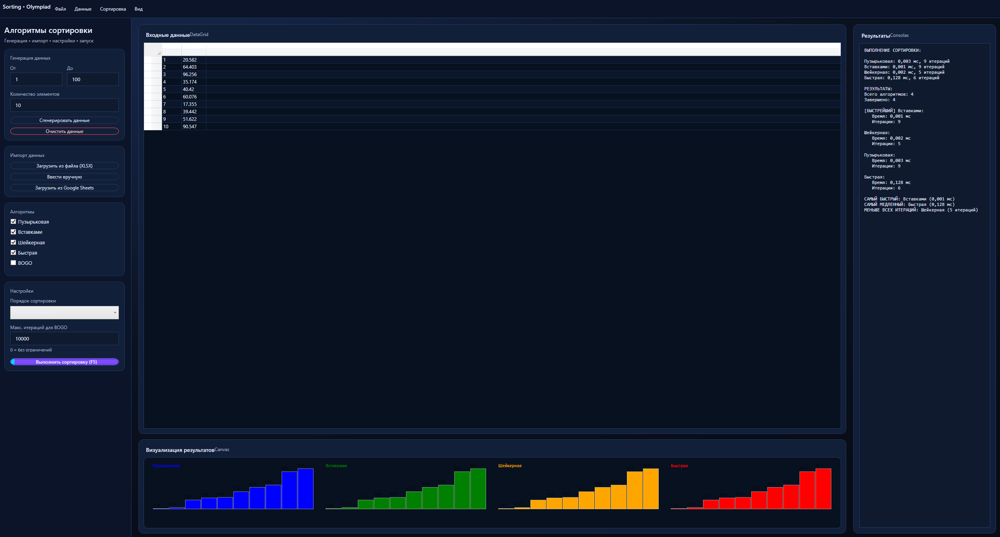
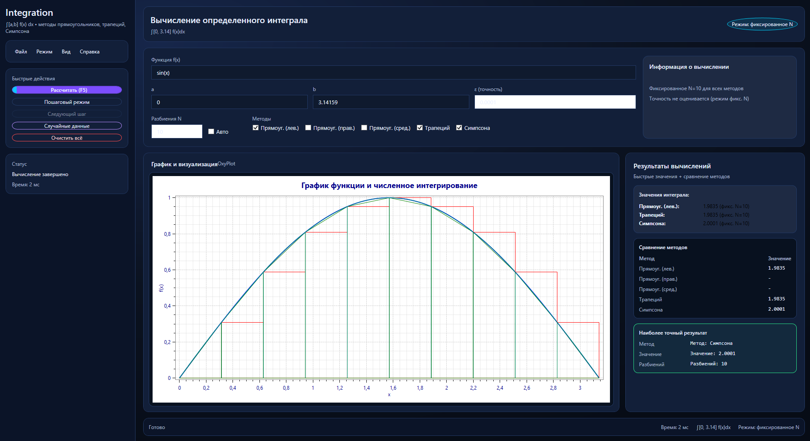
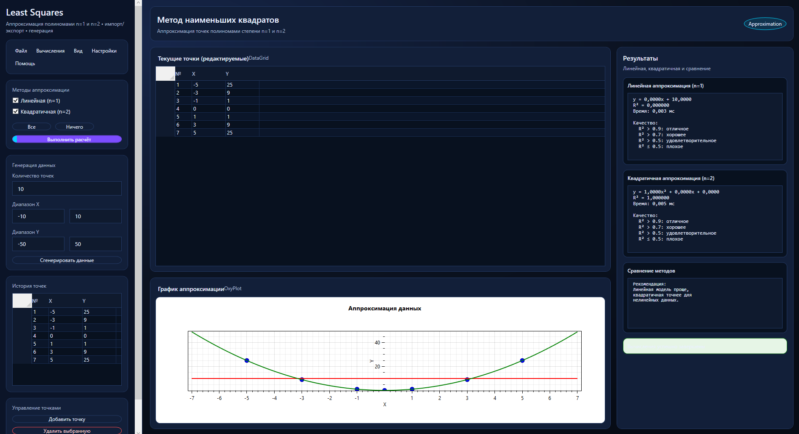

# 数値計算の小さな道場 (WPF) かも (・◇・)ゞ
**Numerical Math Methods** — учебное WPF‑приложение на C#, где собраны основные численные методы и алгоритмы.  
Вводишь данные → считаешь → смотришь графики/таблицы → сравниваешь результаты. かも

---

## Меню (入口) かも

---

## Модули かも (・◇・)

### 1) Метод дихотомии (二分法) かも
Поиск решения на интервале / итерационное уточнение (как в задании).  

---

### 2) Метод золотого сечения (黄金分割) かも
Оптимизация на интервале с точностью ε.  

---

### 3) Метод Ньютона (ニュートン法) かも
Итерационный метод (поиск корня/экстремума — согласно модулю) с контролем точности и итераций.  

---

### 4) Методы решения СЛАУ (連立一次方程式) かも
Решение системы линейных уравнений разными способами (сравнение и вывод результата).  

---

### 5) «Олимпиадные сортировки» (ソート) かも
Сравнение алгоритмов сортировки, генерация/ввод данных и визуализация.  

---

### 6) Вычисление определённого интеграла (定積分) かも
Численное вычисление ∫ f(x) dx на [a, b] с заданными параметрами.  

---

### 7) Метод покоординатного спуска + 3D (座標降下 + 3D) かも (・◇・)ゞ
Поиск экстремума f(x, y) и визуализация поверхности/траектории.  

---

### 8) Метод наименьших квадратов (最小二乗法) かも
Аппроксимация точек (n=1, n=2), таблица данных и график.  

---

## Технологии かも
- C# / .NET + WPF
- Таблицы: `DataGrid`
- Графики: OxyPlot (2D) *(если подключено в модуле)*
- 3D: HelixToolkit.Wpf *(для покоординатного спуска)*

---

## Запуск かも (・◇・)ゞ
### Вариант A: из Release (рекомендуется)
1. Скачайте архив из **Releases → Assets**
2. Распакуйте
3. Запустите `.exe`

### Вариант B: из исходников
1. Откройте решение в Visual Studio
2. Восстановите NuGet‑пакеты
3. Запуск (F5)

---

## 桜のように舞い散った我的神経

**このコードは私の心の平和的を散らしました。**  
*(Этот код развеял мой душевный покой как лепестки сакуры)*

🌸 花は散り、コードは残る 🌸

